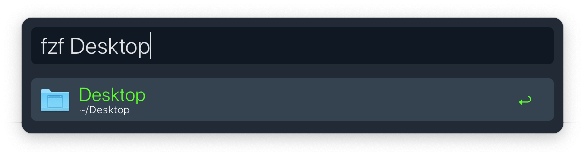
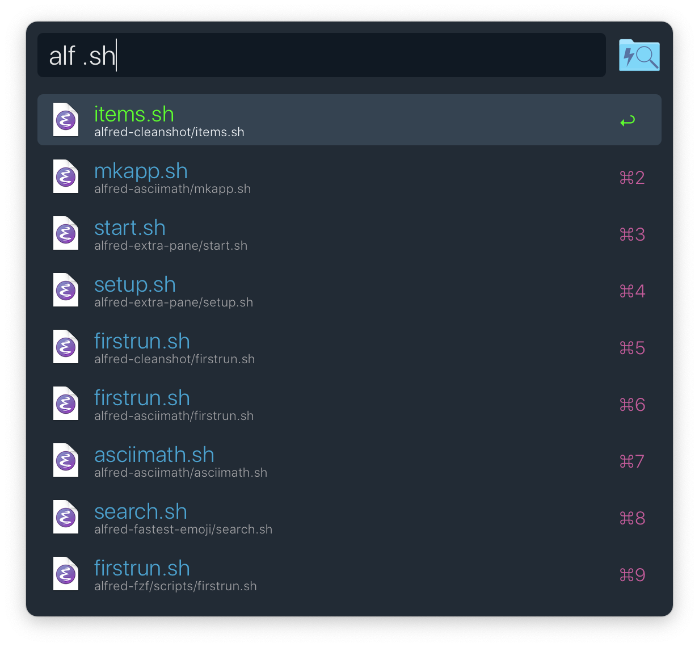
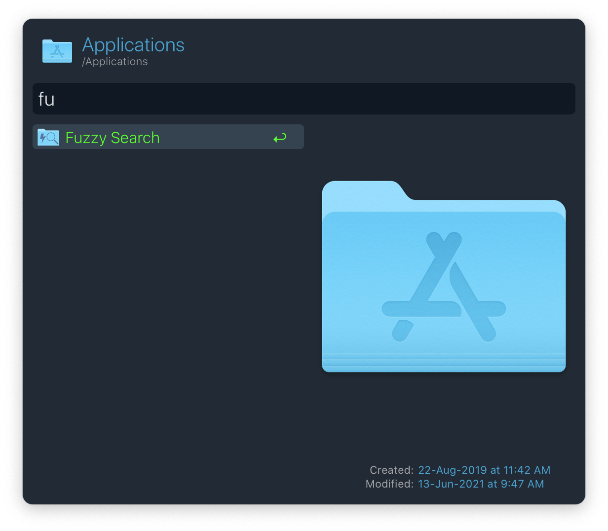
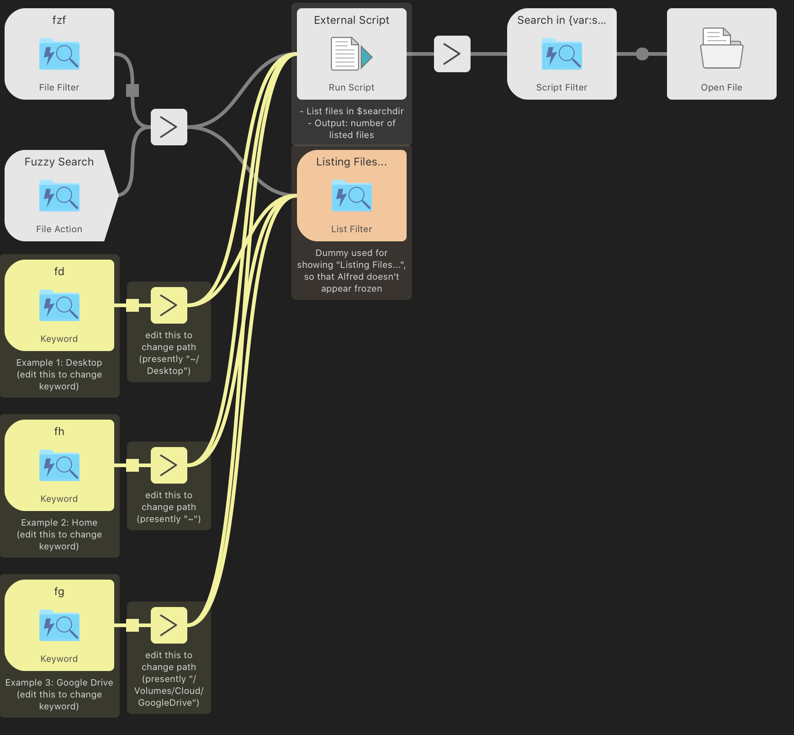

<h1 align="center">

<a href="https://github.com/mr-pennyworth/alfred-fzf/releases/latest/">
   
   
</a>
  Instant Fuzzy File Search for Alfred
</h1>

List all the files inside a folder using [`fd`][1],
and instantly fuzzy-search through all of them using [`fzf`][2],
all from inside [Alfred][3] with a single keyword: `fzf`.

## Screenshots
<h4 align="center">Invoke with <code>fzf</code></h4>

<h4 align="center">Search through tens of thousands of files</h4>

<h4 align="center">Fuzzy search shows most relevant results</h4>

<h4 align="center">There's a folder action too!</h4>

<h4 align="center">Search even inside apps</h4>

<h4 align="center">Manually create folder-specific keywords</h4>

[1]: https://github.com/sharkdp/fd
[2]: https://github.com/junegunn/fzf
[3]: https://www.alfredapp.com
